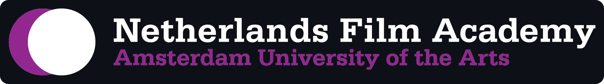

Welcome to the Netherlands Filmacademy's Visual Effects & Immersive Media GitHub. Our [ShotGrid Configuration](https://github.com/nfa-vfxim/nfa-shotgun-configuration) and our adapted and custom apps reside here. Everything here was made or adapted by our VFX students to strengthen our VFX pipeline! It's all used on a daily basis during the creation of our student films. Feel free to look around, use, fork or create pull requests on all our repositories. 
 
 

#### The people behind our pipeline
[Bo Kamphues](https://github.com/bkamphues) (graduated 2021)  
[Gilles Vink](https://github.com/gillesvink) (graduated 2022)  
[Max de Groot](https://github.com/maximumfx) (4th year student)  
[Mervin van Brakel](https://github.com/breaktools) (3rd year student)  
